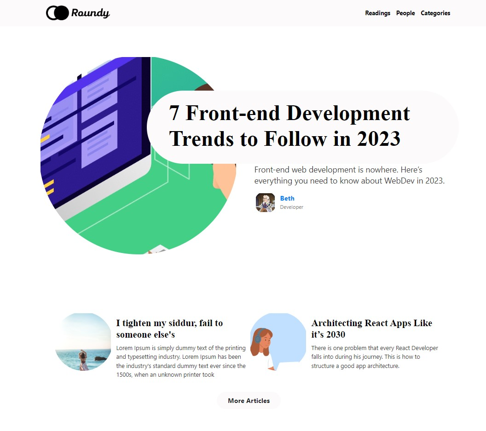
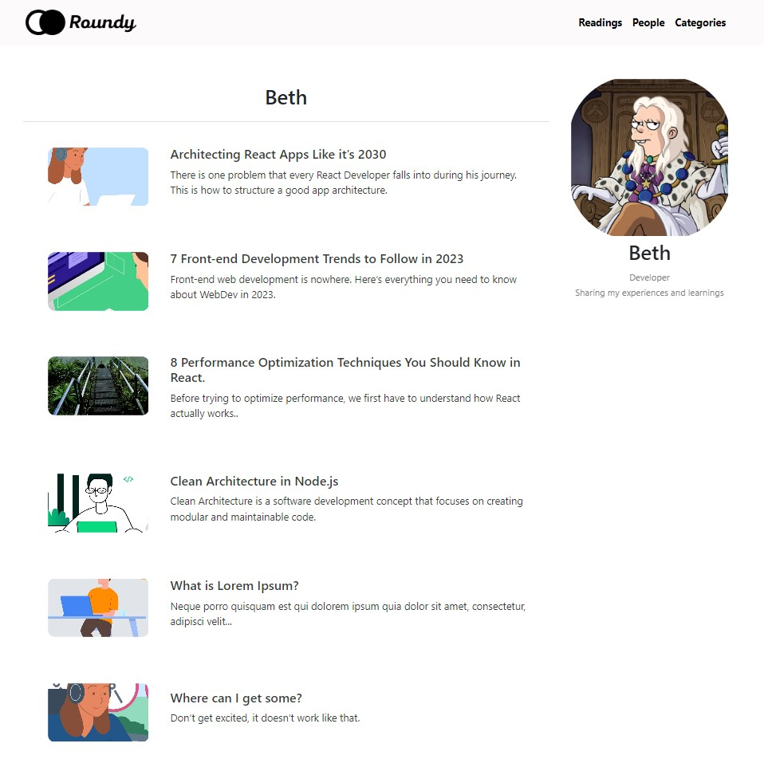
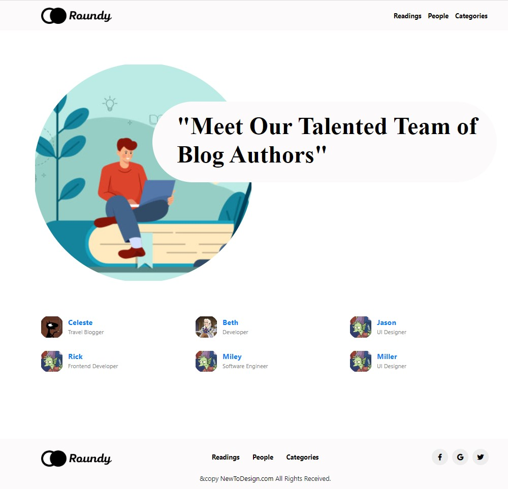
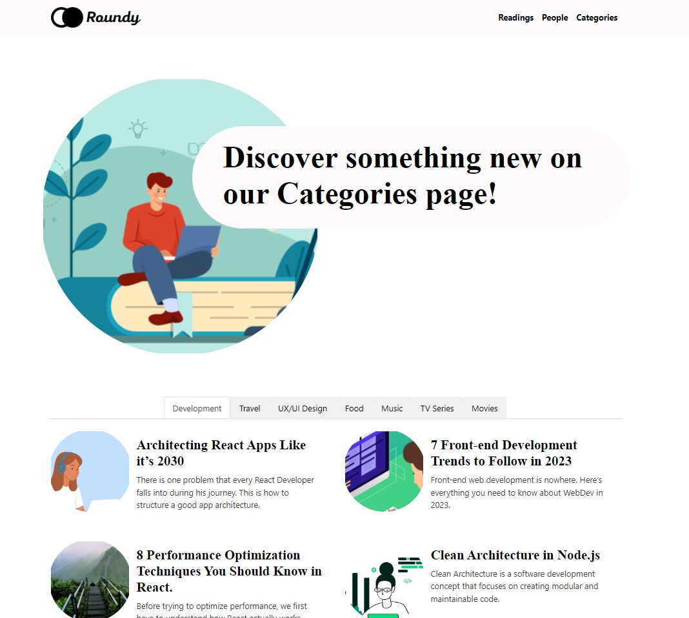
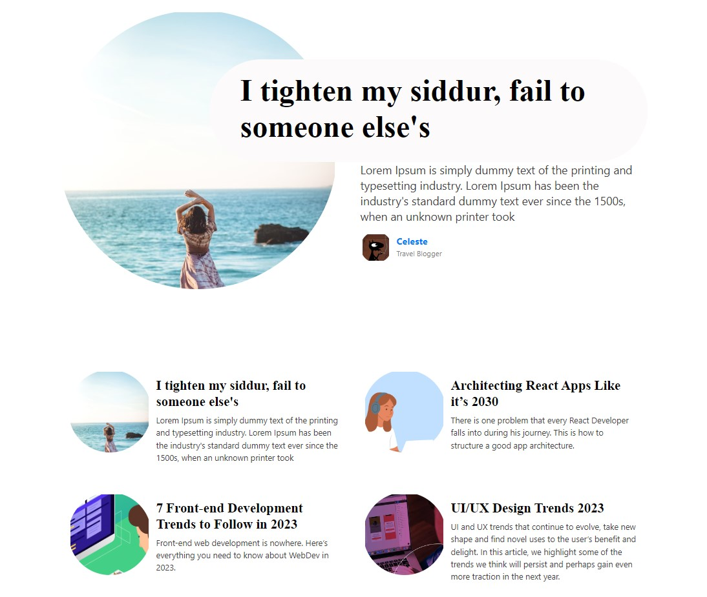

# #Blog

This application is a simple blog website developed for learning SSR using Next.js with a Bootstrap theme, and the frontend is developed using React with a component-based approach.

To focus on the project's purpose, it is developed with data provided from a JSON file instead of a database.

## Screenshots

